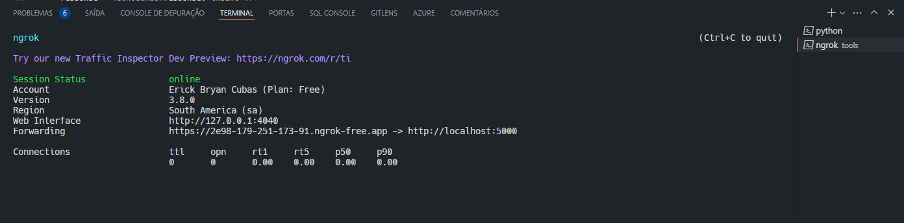
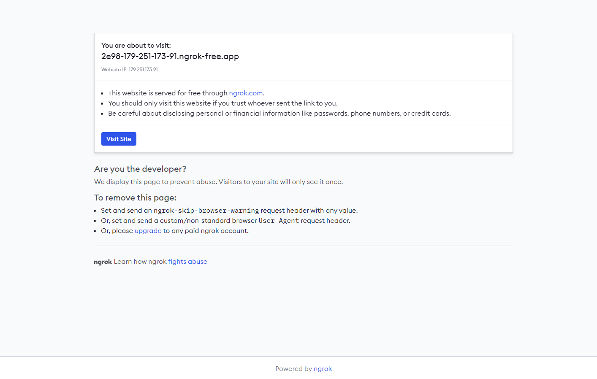
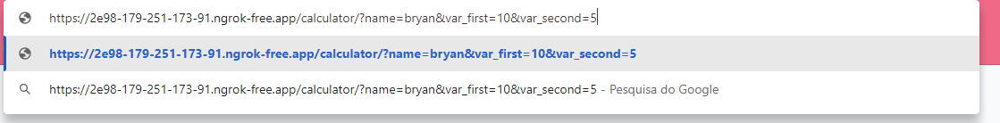
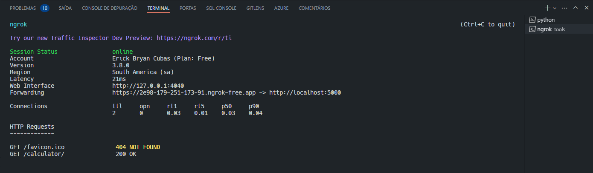

# 🛠️ Hospede sua API Flask com o Ngrok

## Introdução ao Ngrok

O Ngrok é uma ferramenta que cria túneis seguros para a internet, facilitando a exposição de servidores locais. Isso é especialmente útil para desenvolvedores que precisam compartilhar suas aplicações locais com outros usuários remotamente.

### Por que optar pelo Ngrok?

Para desenvolvedores que estão construindo APIs, o Ngrok é um recurso indispensável. Ele permite testar a API em um ambiente local e simultaneamente disponibilizá-la para acesso externo.

### Como instalar o Ngrok

A instalação do Ngrok pode ser feita facilmente utilizando o Chocolatey, um gerenciador de pacotes para Windows. Simplesmente abra o terminal e digite:

```shell
choco install ngrok
```

## 📦 Configurando o ambiente para sua API Flask

Antes de iniciar a sua API, é recomendável configurar um ambiente virtual e instalar todas as dependências necessárias. Você pode fazer isso com os seguintes comandos:

```shell
python -m venv flask-ngrok-venv
.\flask-ngrok-venv\Scripts\activate
pip install flask
```

## 🚀 Executando a aplicação Flask com o Ngrok

Primeiro, execute sua aplicação Flask. Em um terminal, navegue até o diretório do seu projeto e execute:

```shell
python .\src\app.py
```

Em um segundo terminal, vá até o diretório onde o Ngrok foi instalado e inicie o serviço para escutar na porta usada pelo seu servidor Flask, geralmente a porta 5000:

```shell
cd '\ProgramData\chocolatey\lib\ngrok\tools'
./ngrok http 5000
```



Após iniciar o Ngrok, ele fornecerá um URL público que redireciona para sua aplicação Flask local. Copie esse link e você poderá compartilhá-lo para que outros usuários acessem sua API remotamente.



## 🌐 Acessando a API via Ngrok

Com a URL fornecida pelo Ngrok, qualquer pessoa com acesso à internet pode interagir com sua API. Por exemplo, se você tem um endpoint `/calculator`, ele pode ser acessado assim:

`[URL do Ngrok]/calculator/?name=bryan&var_first=10&var_second=5`



O resultado será algo como:

```json
{
  "name": "bryan",
  "addition": 15.0,
  "subtraction": 5.0,
  "multiplication": 50.0,
  "division": 2.0
}
```

### 📊 Monitorando o tráfego

No terminal onde o Ngrok está rodando, você pode observar todas as requisições feitas à sua API, o que é excelente para debugging e monitoramento de acessos.

Este tutorial simplifica o processo de compartilhamento de uma API Flask usando o Ngrok, tornando-o acessível a desenvolvedores de todos os níveis.


